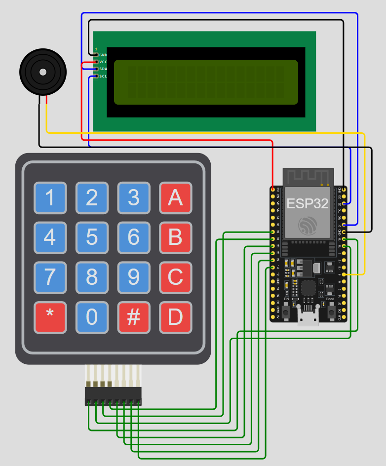

# Offline Mesh Network using ESP-NOW

An offline, peer-to-peer IoT communication system utilizing ESP32 microcontrollers to facilitate secure, router-independent messaging. This project implements a custom hardware interface for inter-node communication, secured by a lightweight cryptographic cipher and extended by a Bluetooth (BLE) gateway for mobile monitoring.

## System Features

- **Decentralized Communication:** Utilizes the ESP-NOW protocol for low-latency, Wi-Fi router-independent data transmission between ESP32 nodes.
- **Hardware Interface:** Integrates a 4x4 matrix keypad for user input, a 16x02 I2C LCD for message display, and a piezoelectric buzzer for auditory alerts.
- **Data Security:** Implements a symmetric XOR encryption cipher (`0xAA`) at the payload level to obscure broadcasted messages from unauthorized interception.
- **Mobile Gateway:** Features a Bluetooth Serial integration (`ESP32_AlertNode`) allowing paired smartphones to receive critical system alerts remotely.

## Hardware Components List

| S. No | Components |
| :--- | :--- |
| 1 | ESP-WROOM-32 or ESP32 Dev Kit |
| 2 | 4x4 Membrane Keypad |
| 3 | LCD 16x02 (I2C) |
| 4 | Buzzer Module |
| 5 | Jumper Wires |
| 6 | Battery or any Power source |
| 7 | Breadboard (Optional) |

### Hardware Pin Mapping:

The system relies on specific GPIO assignments to avoid hardware conflicts (specifically isolating GPIO 14 from the buzzer on Node B).

| Component | ESP32 GPIO (Node A & B) |
| :--- | :--- |
| **I2C LCD (SDA)** | GPIO 21 |
| **I2C LCD (SCL)** | GPIO 22 |
| **Keypad Rows (1-4)** | GPIO 19, 18, 32, 33 |
| **Keypad Cols (1-4)** | GPIO 25, 26, 27, 14 |
| **Buzzer** | GPIO 13 (Node B) |



## Message Matrix

The 4x4 matrix keypad is mapped to transmit predefined strings over the mesh network.

| Key | Message Transmitted | Key | Message Transmitted |
| :--- | :--- | :--- | :--- |
| **1** | Hello | **8** | Break |
| **2** | Meet me | **9** | Ok |
| **3** | File Ready | **0** | Node Toggle |
| **4** | Wait | **A-D** | Target Node Selection |
| **5** | System Down | **\*** | Alert |
| **6** | Work Done | **#** | Disconnect |


## Getting Started

1. Open `Node_A_Transmitter.ino` and `Node_B_Receiver.ino` in the Arduino IDE.
2. Install required libraries: `Keypad`, `LiquidCrystal_I2C`, and `BluetoothSerial`.
3. Flash the transmitter code to the primary ESP32 and the receiver code to the secondary ESP32.
4. Supply 5V power to both nodes. The LCD will display "Node Started" upon successful initialization.
5. Use keys A-D to select the target MAC address, then press a numeric key to transmit the encrypted payload.

## Repository Structure

This Structures includes all the four branches of the repository.

```
esp32-offline-mesh-network/  ----> [Repository Root]
|
├── 📂 BRANCH: main
│   ├── Node_A_Transmitter/
|   |   └── Node_A_Transmitter.ino
│   ├── Node_B_Receiver/
|   |   └── Node_B_Receiver.ino
│   ├── docs/
|   |   ├── Circuit_Diagram.png
|   |   ├── ESP32_Offline_Mesh_Network_Report.pdf
|   |   ├── Graphical_Diagram.png
|   |   ├── Output_1_Bluetooth.jpg
|   |   └── Output_2_Serial.jpg
│   ├── simulation/
|   |   └── wokwi_connections.json
|   ├── .gitignore
|   ├── LICENSE
│   └── README.md
│
├── 📂 BRANCH: legacy/hybrid-keyboard
│   ├── Node_A_Transmitter/
|   |   └── Node_A_Transmitter.ino
│   ├── Node_B_Receiver/
|   |   └── Node_B_Receiver.ino
|   ├── .gitignore
|   ├── LICENSE
│   └── README.md
│
├── 📂 BRANCH: legacy/serial-complete
│   ├── Node_A_Transmitter/
|   |   └── Node_A_Transmitter.ino
│   ├── Node_B_Receiver/
|   |   └── Node_B_Receiver.ino
|   ├── .gitignore
|   ├── LICENSE
│   └── README.md
|
├── 📂 BRANCH: legacy/serial-only
│   ├── Node_A_Transmitter/
|   |   └── Node_A_Transmitter.ino
│   ├── Node_B_Receiver/
|   |   └── Node_B_Receiver.ino
|   ├── .gitignore
|   ├── LICENSE
│   └── README.md
```

## Branch Architecture & Version Control Strategy

* This repository utilizes branches to preserve distinct developmental phases of the project rather than standard feature integration. These branches are intentionally left unmerged into the main branch.

* Integrating all iterations into a single codebase would require complex conditional compilation macros, making the code difficult to read and deploy. By isolating these phases into separate branches, the repository provides fully functional, standalone environments tailored to different hardware availability and testing requirements.


## Component Availability Guide

Depending on the physical hardware you have available, you can switch to the corresponding branch to deploy a functional version of this mesh network:

1. `main`: Select this branch if you have the complete hardware suite (ESP32 modules, 4x4 Matrix Keypads, 16x02 I2C LCDs, and Buzzers). This is the final, fully integrated physical prototype featuring XOR encryption and the Bluetooth gateway.

2. **legacy/`hybrid-keyboard`**: Select this branch if you have only the LCD and Buzzer, and wish to bypass the XOR encryption and Bluetooth gateway to test purely hardware-driven, plaintext ESP-NOW messaging.

3. **legacy/`serial-complete`**: Select this branch if you only possess ESP32 modules. This version bypasses all physical peripherals, relying entirely on the PC Serial Monitor for input and output while retaining the full XOR cryptographic payload and Bluetooth gateway logic.

4. **legacy/`serial-only`**: Select this branch if you only possess ESP32 modules and want the absolute bare-minimum codebase. This strips away all cryptography and Bluetooth overhead, providing a raw, unencrypted ESP-NOW communication link for fundamental testing.
